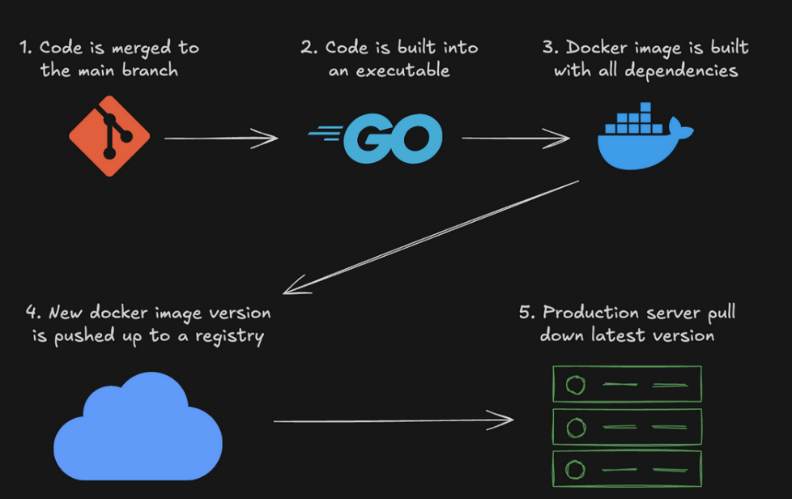

# DOCKER Course Notes

## Couple Moving Parts to Keep in mind
<details open> 
    <summary>🧠 Open To Read more</summary>

1. The "Docker server" or "Docker Daemon".

This listens to requests from the desktop app and executes them.

If this isn't running NOTHING ELSE will work.

2. The "Docker Desktop" GUI.

Starting the GUI should start the server, at least that's how I usually ensure the server is running.

The GUI is the VISUAL way to interact with Docker.

3. The Docker CLI.

As a developer, most of your work will be interacting with Docker via the CLI.

I'd recommend using the GUI to visualize what's going on with Docker, but executing most of your commands through the command line.

</details>

## What Is Docker?

Docker makes development efficient and predictable

takes away repetitive, mundane configuration tasks and is used throughout the development lifecycle for fast, easy and portable application development – desktop and cloud.

Put simply: Docker allows us to deploy our applications inside "containers", which are kind of like very lightweight virtual machines.

Instead of just shipping an application, we can ship an application and the environment it runs in.

## Docker Hub

- is the official cloud service for storing and sharing Docker images

```
"For most of my career, if my company used AWS to deploy, we used AWS to host our images. If we used GCP to deploy, we hosted images on GCP. I'd usually just use whatever's most convenient and cost effective, the features are very similar between providers."
```

<hr />

# CONTAINERS

- is a standard unit of software that packages up code and all its dependencies so the application runs quickly and reliably from one computing environment to another.

- We've had virtual machines (like VirtualBox) for a long time. The trouble with virtual machines is that they're SLOW as h\*ck. Booting one up usually takes LONGER than a physical machine.

- Containers, on the other hand, gives us 90% of the benefits of virtual machines, but are SUPER lightweight.

Containers boot up in SECONDS, while virtual machines can take minutes.

## Why Are Containers Lightweight?

- Virtual machines virtualize hardware, they emulate what a physical computer does at a LOW level.


- Containers virtualize at the operating system level. Isolation between containers that are running on the SAME machine is still really good.

- For the most part, each container feels like it has its own operating and filesystem. In reality, a lot of resources are being shared, but they're being shared securely through namespaces.


<hr />

# IMAGES

- Container: an INSTANCE of a virtualized read-write environment

- Image: A READ-ONLY DEFINITION of a CONTAINER, a definition of the APP and EVERYTHING it needs to run.

- A CONTAINER is basically an IMAGE that's ACTIVELY RUNNING.

In other words, you BOOT up a CONTAINER FROM an IMAGE.

- You can create multiple separate CONTAINERS all from the SAME IMAGE (it's kinda like the relationship between classes and objects).

## Running A Container

```zsh
    docker run -d -p hostport:containerport namespace/name:tag
```

- `-d`: Run in detached mode (doesn't block your terminal)
- `-p`: Publish a container's port to the host (forwarding)
- `hostport`: The port on your local machine
- `containerport`: The port inside the container
- `namespace/name`: The name of the image (usually in the format username/repo)
- `tag`: The version of the image (often latest)

## Stop a Container

- `docker stop`: This stops the container by issuing a SIGTERM signal to the container.

You'll typically want to use docker stop.

- `docker kill`: This stops the container by issuing a SIGKILL signal to the container.

This is a more forceful way to stop a container, and should be used as a last resort.

## VOLUMES

<details> 
    <summary>🧠 Open To Read more</summary>

By DEFAULT, Docker containers DON'T RETAIN any state from past containers. For example, if I:

1. Start a container from an image
2. Make some CHANGES to the filesystem (like installing a new package) in that container
3. Stop the container
4. Start a new container from the same image
5. The new container does not have the changes I made in step 2.

<p>
However, if I restart the stopped container, it will have the changes I made. This is only worth mentioning because sometimes developers think that killing an old container and starting a new one is the same as restarting a process - but that's not true... it's more like resetting the state of the entire machine to the original image.
</p>

- Docker does have ways to support "persistent state" through `STORAGE VOLUMES`.

- They're basically a filesystem that lives outside of the container, but can be accessed by the container.

</details>

## Persist Quiz Notes

- A container's file system is read-write, but when you delete a container, and start a new one from the same image, that new container starts from scratch again with a copy of the image. All stateful changes are lost.

- A volume's file system is read-write, but it lives outside a single container. If a container uses a volume, then stateful changes can be persisted to the volume even if the container is deleted.

- Volumes are often used by applications like Ghost, Grafana, or WordPress to persist data so that when a container is deleted and a new one is created the state of the application isn't lost.

Containerized applications are typically thought of as ephemeral (temporary). If your application breaks just because you deleted and recreated a container... it's not a very good containerization!

# EXEC (EXECUTE)

- When it comes to deploying applications with Docker, you'll usually just let the container do its thing

- it is possible to run commands inside a running container! It's kinda like the container version of sshing into a remote server and running a command.

- Syntax: `docker exec CONTAINER_ID ls`

For instance, to listing the files in current remote server

## EXEC Netstat

- The netstat command shows us which programs are bound to which ports `netstat -ltnp`

## Live Shell

Being able to run one-off commands is nice, but it's often more convenient to start a SHELL SESSION running WITHIN the CONTAINER itself.

<hr />

# Docker NETWORKS

## Offline

- The docker run command has a `--network none` flag that makes it so that the container can't network with the outside world, which is super useful for isolating containers.

You might be thinking, "why would I want to turn off networking?!?" Well, usually it's for security reasons. You might want to remove the network connection from a container in one of these scenarios:

- You're running 3rd party code that you don't trust, and it shouldn't need network access
- You're building an e-learning site, and you're allowing students to execute code on your machines
- You know a container has a virus that's sending malicious requests over the internet, and you want to do an audit

## Load Balancers

A load balancer behaves as advertised: it balances a load of network traffic across some number of servers. Think of a huge website like Google.com. There's no way that a single server (literally a single computer) could handle all of the Google searches for the entire world. Google uses load balancers to route requests to different servers.

A central server, called the "load balancer", receives traffic from users (aka clients), then routes those requests to different back-end application servers. In the case of Google, this splits the world's traffic across potentially many different thousands of computers.

A good load balancer sends new traffic to servers that have lower current resource utilization (CPU and memory). The goal is to "balance the load" so that no single backend server becomes overwhelmed. There are many strategies that load balancers use, but a simple strategy is the "round robin" where requests are simply routed one after the other to different back-end servers:

- Request 1 -> Server 1
- Request 2 -> Server 2
- Request 3 -> Server 3
- Request 4 -> Server 1
- Request 5 -> Server 2
  ...


## Custom Network

<details>
    <summary>🧠 Open to Read</summary>

We can create custom <b>bridge</b> networks so that containers can communicate with each other if we want them to
but still otherwise remain isolated.

Let's build a system where our application servers are HIDDEN WITHIN a custom network, and only our load balancer is exposed to the host.

- This is a very common setup in backend architecture. The load balancer is exposed to the public internet, but the application servers are only accessible via the load balancer.
</details>

### Caddyfiles

Caddy works great as a file server, which is what our little HTML servers are, but it also works great as a load balancer! To use Caddy as a load balancer we'll need to create a custom Caddyfile to tell Caddy how we want it to balance the traffic. It's just a config file for Caddy.

```
localhost:80

reverse_proxy caddy1:80 caddy2:80 {
	lb_policy       round_robin
}
```

This tells Caddy to run on localhost:80, and to round robin any incoming traffic to caddy1:80 and caddy2:80.

Remember, this only works because we're going to run the loadbalancer on the SAME network, so caddy1 and caddy2 will automatically resolve to our application server's containers.

<hr />

# Dockerfiles

Docker isn't only useful for running other people's software (as we've been doing so far). It's also a great way to build and package our own software.

I've used Docker both ways. As a DevOps/platform engineer I'm usually using other's images,

but as a backend developer I was usually building images for our own servers.

- Docker images are built from Dockerfiles

- A Dockerfile is just a text file that contains all the commands needed to assemble an image. It's essentially the "Infrastructure as Code" (IaC) for an image. It runs commands from top to bottom, kind of like a shell script.

- Instead of manually installing dependencies on servers and making updates manually, we can check a Dockerfile into source control and build it automatically. Mhmmmm, automation.

```
docker build . -t helloworld:latest

The -t helloworld:latest flag tags the image with the name "helloworld" and the "latest" tag. Names are used to organize your images, and tags are used to keep track of different versions.
```

## Creating an Environment

- "What's the point of dockerizing this simple service"? Well, at the moment, there are only a couple of benefits:

1. Anyone with Docker can run your image, regardless of their OS

2. You can easily deploy containers of your image on any cloud service that uses images (most of them) or on an orchestration server like Kubernetes.

3. If your server were written in a language like Python or JavaScript, you could bundle the interpreter and dependencies INSIDE the image so that you don't need to reconfigure them on the server.

- one of the best things about Docker is that it allows you to ship an entire environment.

<hr />

# DEBUG

## Docker Logs

When containers are running in detached mode with the -d flag, you don't see any output in your terminal, which is nice for keeping your terminal clean, but what if something goes wrong?

```
docker logs [OPTIONS] CONTAINER
# CONTAINER can be an id or name
```

## Stats

-we know how to inspect a containers logs, but what if we want to see the resource utilization?

- It's common to spin up some Docker containers, forget about them, and then wonder why your host machine has gotten really slow. It's really nice to see how much RAM/CPU each container is using, and it's critical in production environments.

## Top

The docker top command shows the running processes inside a container.

- Use stats for entire containers and top for processes in a container.

## Resource Limits

When you notice a container's using too many resources, if you don't have the time or the ability to "fix" the code, you can LIMIT the resources the container has available

- The docker run command has a few options for limiting resources:

```
--memory: Limit the memory available to the container

--cpus: Limit the CPU shares available to the container
```

<hr />

# PUBLISH

- Docker Hub is the official cloud service for storing and sharing Docker images. We call these kinds of services "registries". Other popular image registries include:

## Delete and PULL
Let's delete our local copy of the image, then pull it back down from Docker Hub. Just like with GitHub, the nice thing about having images in the cloud is that if something happens to your computer, or you're working on another machine, you can always pull down your images.

```
docker image rm USERNAME/goserver

docker pull USERNAME/goserver

docker run -p 8991:8991 USERNAME/goserver
```

## Tags

Let's publish a new version of our web server. With Docker, a tag is a label that you can assign to a specific version of an image, similar to a tag in Git.

The latest tag is the default tag that Docker uses when you don't specify one. It's a convention to use latest for the most recent version of an image, but it's also common to include other tags, often semantic versioning tags like 0.1.0, 0.2.0, etc.

### Deployment Pipelines

Publishing new versions of Docker images is a very common method of deploying cloud-native back-end servers.

Here's a diagram describing the deployment pipeline of many production systems 



## Latest

If you look closely, you'll notice that your old version is tagged "latest"... that's a bit confusing.

As it turns out, the latest tag doesn't always indicate that a specific tag is the latest version of an image. 

In reality, latest is just the default tag that's used if you don't explicitly supply one. We didn't use a tag on our first version, that's why it was tagged with "latest".

### Should I Use “latest”?

The convention I'm familiar with is to use semantic versioning on all your images, but to also push to the "latest" tag on your most recent image. That way you can keep all of your old versions around, but the latest tag still always points to the latest version.

So, for example, if I were updating an application to version 5.4.6, I would probably do it like this:

```
docker build -t bootdotdev/awesomeimage:5.4.6 -t bootdotdev/awesomeimage:latest .
docker push bootdotdev/awesomeimage --all-tags
```

## The Bigger Picture
## The Deployment Process
1. The developer (you) writes some new code
2. The developer commits the code to Git
3. The developer pushes a new branch to GitHub
4. The developer opens a pull request to the main branch
5. A teammate reviews the PR and approves it (if it looks good)
6.The developer merges the pull request
7. Upon merging, an automated script, perhaps a Github action, is started
8. The script builds the code (if it's a compiled language)
9. The script builds a new docker image with the latest program
10. The script pushes the new image to Docker Hub
11. The server that runs the containers, perhaps a Kubernetes cluster, is told there is a new version
12. The k8s cluster pulls down the latest image
13. The k8s cluster shuts down old containers as it spins up new containers of the latest image